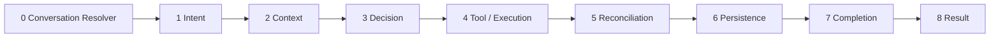
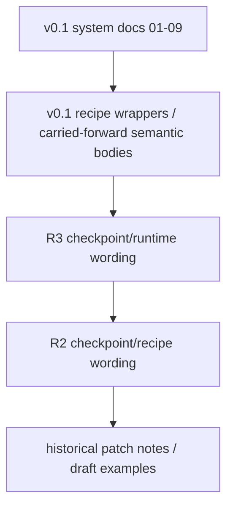
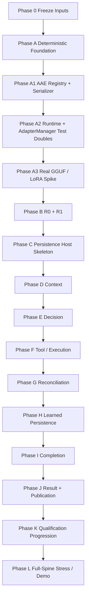

# A.R.C.A.D.I.A. v0.1 — Command Center

> [!success] Frozen pre-build checkpoint
> **Design state:** frozen for implementation.  
> **Runtime state:** not yet qualified.  
> **Next authoritative action:** follow [[02_ARCADIA_V0_1_EXACT_BUILD_ORDER|Exact Prototype Build Order]] without skipping gates.

This vault is a navigation layer over the validated **2026-08-29 v0.1 prototype build checkpoint**. The canonical source bodies are preserved; generated metadata, links, maps, and diagrams sit outside the frozen source text.

## Start here

| Need | Open |
|---|---|
| Understand the whole checkpoint | [[01_ARCADIA_V0_1_FULL_PROJECT_CHECKPOINT|Full Project Checkpoint]] |
| Build it | [[02_ARCADIA_V0_1_EXACT_BUILD_ORDER|Exact Build Order]] |
| Use the single consolidated authority | [[ARCADIA_V0_1_MASTER_BUILD_AUTHORITY|Master Build Authority]] |
| Check cross-cutting laws | [[03_ARCADIA_V0_1_GLOBAL_CONTRACTS_AND_INVARIANTS|Global Contracts & Invariants]] |
| Trace learned-call boundary | [[04_ARCADIA_V0_1_AAE_CONTRACT_REGISTRY_AND_SERIALIZATION|AAE Contract Registry]] |
| Build runtime / adapter manager | [[05_ARCADIA_V0_1_MODEL_RUNTIME_ADAPTER_MANAGER|ModelRuntime + AdapterManager]] |
| Know what must pass | [[06_ARCADIA_V0_1_QUALIFICATION_AND_STRESS_GATES|Qualification & Stress Gates]] |
| Navigate all nine recipes | [[MOC - Recipe Spine]] |
| Trace R3 stress resolutions | [[MOC - Stress Locks and Provenance]] |
| Inspect implementation references | [[MOC - Reference Implementation and Storage]] |

## System spine

## Authority ladder

> [!important] Supersession rule
> When wording conflicts, **higher authority wins**. The long recipe bodies remain semantically authoritative unless a v0.1 system contract explicitly supersedes their runtime or cross-cutting wording.

## Build map

## Core maps

- [[MOC - Build and Authority]]
- [[MOC - Recipe Spine]]
- [[MOC - Runtime AAE and Qualification]]
- [[MOC - Persistence Recovery and Evidence]]
- [[MOC - Stress Locks and Provenance]]
- [[MOC - Reference Implementation and Storage]]
- [[Vault Conversion and Integrity Manifest]]

## Frozen checkpoint numbers

| Item | Frozen value |
|---|---:|
| Semantic recipes | **9** |
| Physical LoRA adapters | **15** |
| Five-slice actual learned calls | **87** |
| Historical balanced AAE template pair | syntax template, not call #88 |
| Build posture | deterministic host first; runtime boundary second; qualification before full training |

> [!danger] The line this checkpoint refuses to blur
> **Documentation validation passed. Runtime qualification has not.** A.R.C.A.D.I.A. earns learned authority only through the pinned runtime gates.
