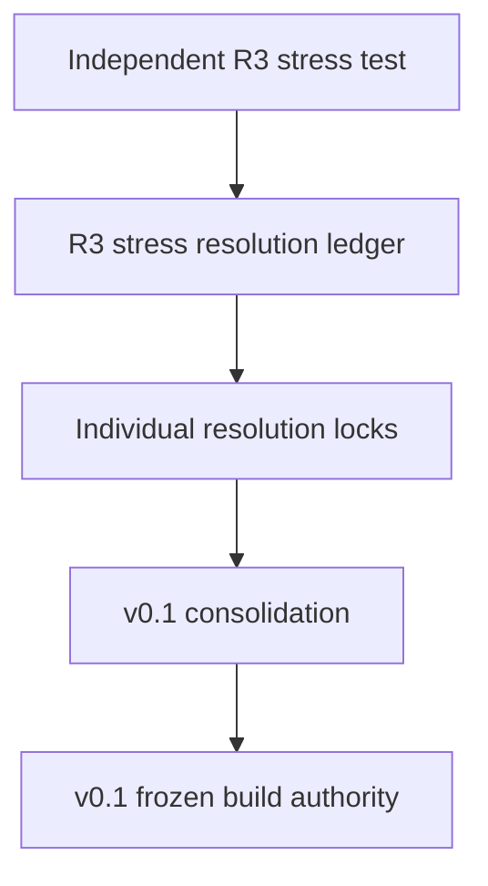

# MOC — Stress Locks and Provenance

## Independent stress lineage

- [[ARCADIA_R3_INDEPENDENT_STRESS_TEST_2026-08-29|Independent R3 Stress Test]]
- [[ARCADIA_R3_STRESS_RESOLUTION_LEDGER_2026-08-28|Stress Resolution Ledger]]
- [[CONSOLIDATION_NOTES|Consolidation Notes]]
- [[10_ARCADIA_V0_1_R3_TO_V0_1_CHANGELOG|R3 → v0.1 Changelog]]

## Resolution locks

- [[ARCADIA_PERF01_DETERMINISTIC_FAST_PATH_LOCK_2026-08-29]]
- [[ARCADIA_ST01_AAE_CALL_DATA_LOCK_2026-08-28]]
- [[ARCADIA_ST03_TRANSACTIONAL_HOT_SWAP_LOCK_2026-08-28]]
- [[ARCADIA_ST04_ATOMIC_ADAPTER_LEASE_LOCK_2026-08-28]]
- [[ARCADIA_ST05_RUNTIME_HEALTH_POISON_LOCK_2026-08-29]]
- [[ARCADIA_ST06_INFERENCE_PROFILE_QUALIFICATION_LOCK_2026-08-29]]
- [[ARCADIA_ST07_AAE_SERIALIZATION_INJECTION_LOCK_2026-08-29]]
- [[ARCADIA_ST08_SOURCE_QUALITY_POLICY_LOCK_2026-08-29]]
- [[ARCADIA_ST09_CRASH_REPLAY_OUTCOME_LOCK_2026-08-29]]
- [[ARCADIA_ST10_TRACE_PRIVACY_TRAINING_FIREWALL_LOCK_2026-08-29]]

> [!note] Provenance rule
> These notes explain **why** a v0.1 contract exists. The integrated v0.1 system documents remain the higher implementation authority when wording differs.
